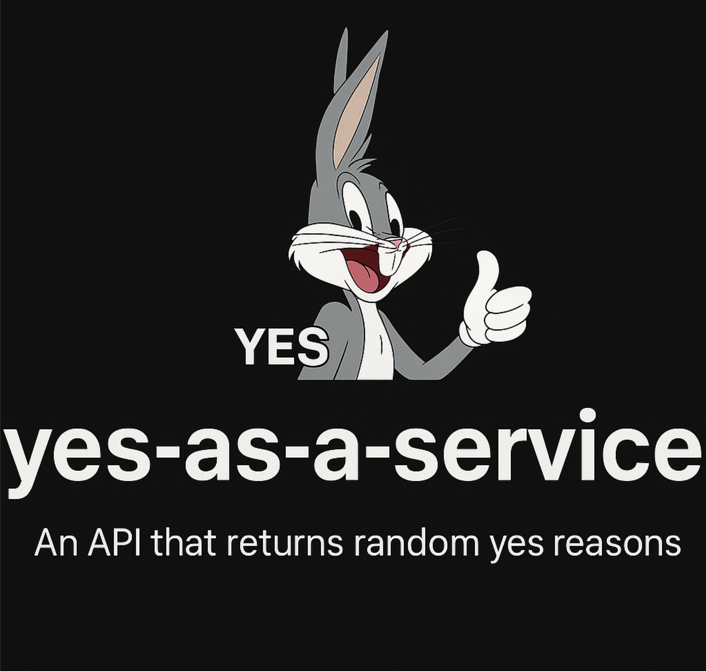

# ✅ Yes-as-a-Service

<p align="center">
  
</p>


Ever needed an enthusiastic way to say "yes"?  
This tiny API returns random, generic, creative, and sometimes hilarious acceptance reasons — perfectly suited for any scenario: personal, professional, student life, dev life, or just because.

Built for humans, opportunities, and positivity.

---

## 🚀 API Usage

**Base URL**
```
https://louis.it.com/yaas/yes
```

**Method:** `GET`  
**Rate Limit:** `120 requests per minute per IP`

### 🔄 Example Request
```http
GET /yes
```

### ✅ Example Response
```json
{
  "reason": "This feels like something Future Me would thank Present Me for agreeing to!"
}
```

Use it in apps, bots, landing pages, Slack integrations, acceptance letters, or wherever you need an enthusiastic (or witty) yes.

---

## 🛠️ Self-Hosting

Want to run it yourself? It's lightweight and simple.

### 1. Clone this repository
```bash
git clone https://github.com/MrNocTV/yes-as-a-service.git
cd yes-as-a-service
```

### 2. Install dependencies
```bash
npm install
```

### 3. Start the server
```bash
npm start
```

The API will be live at:
```
http://localhost:3000/yes
```

You can also change the port using an environment variable:
```bash
PORT=5000 npm start
```

---

## 📁 Project Structure

```
yes-as-service/
├── index.js            # Express API
├── reasons.json        # 1000+ universal acceptance reasons
├── package.json
├── .devcontainer.json  # VS Code / Github devcontainer setup
└── README.md
```

---

## 📦 package.json

For reference, here's the package config:

```json
{
  "name": "yes-as-service",
  "version": "1.0.0",
  "description": "A lightweight API that returns random acceptance or yes reasons.",
  "main": "index.js",
  "scripts": {
    "start": "node index.js"
  },
  "author": "MrNocTV",
  "license": "MIT",
  "dependencies": {
    "express": "^4.18.2",
    "express-rate-limit": "^7.0.0"
  }
}
```

---

## ⚓ Devcontainer

If you open this repo in Github Codespaces, it will automatically use `.devcontainer.json` to set up your environment.  If you open it in VSCode, it will ask you if you want to reopen it in a container.

---

## 👤 Author

Created with enthusiastic positivity by [MrNocTV](https://github.com/MrNocTV)

---

## 📄 License

MIT — do whatever, just don't say no when you should say yes.